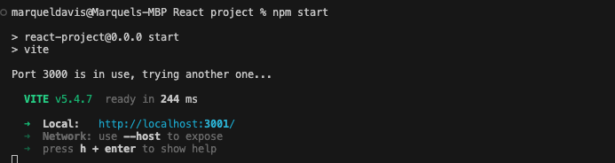

# Interactive-React-Portfolio

## Description 
#### The purpose of this project was to build a front end portfolio website to showcase my projects. 

#### This was a fun but challenging project. Using REACT is a game changer, instead of putting all your eggs in one basket, you can create components. This helped me as I worked through my website. A lot of research and long hours took place, maybe because I am new but I look forward to improving my UI development skills. I would eventually come back to this project to create a more enhance UI, adding more animation and cool features as users view my page. 

  ## Table of Contents
  * [Installation](#installation)
  * [Usage](#usage)
  * [License](#license)
  * [Contributing](#contributing)
  * [Test](#test)
  * [Credits](#credits)
  * [Questions](#questions)
  

  ## Installation
  #### To install the necessary dependencies, run the following command:
  npm install
  #### To install REACT ICONS
  npm i react-icons to display the logo images in my footer section
  
  #### To install VITE 
  npm create vite

  #### To install React-Router-Dom
  npm i react-router-dom

  ## Usage
  
  #### In order to start the application you must write the following code in your terminal:
  npm start or npm run start. 

  

  

  ## Credits 
  Starter code credit to Rutgers boot camp 

   ## License
  This project is license under MIT. 
    
    
    
    
  
  
  ## Contributing
  According to github, on learning how to contribute to someones repo, you can use a fork and pull request1. Here is a link to the github documentation on how to fork and pull request: [Github Documentation](https://docs.github.com/en/get-started/exploring-projects-on-github/contributing-to-a-project)
  Since this is an open source project, check out the this link on contributor covenant: [Contributor Covenant](https://www.contributor-covenant.org/) This is a code of conduct for open source projects.
  
  ## Test
  To run tests, run the following command:
  npm test
  

  
  ## Questions
  If you have any questions about this repo, please contact me directly at marqueljamal12@gmail.com. You can find more of my work on github at [Marquel12](https://github.com/marquel12/Interactive-React-Portfolio) 
  